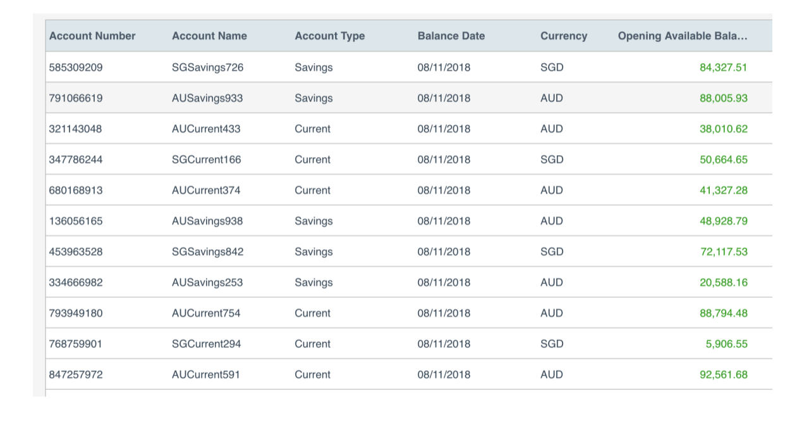
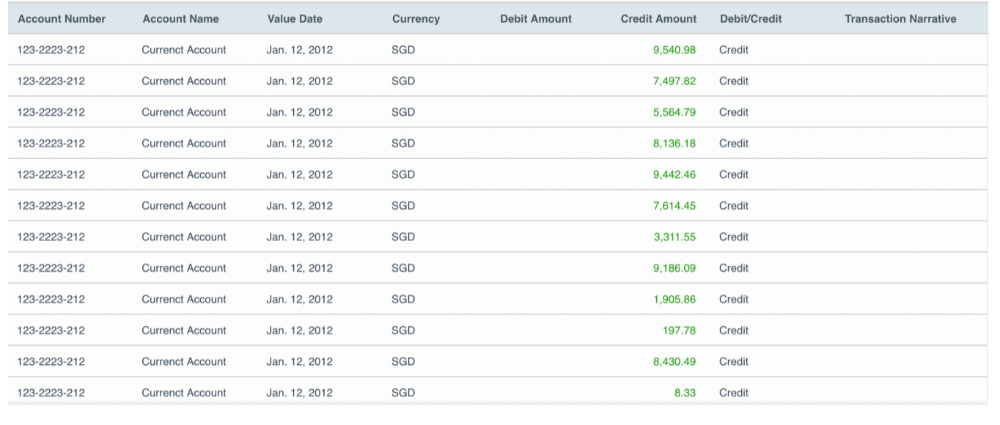

# Account Manager Microservice

This application is to build the backend service
needed to support a web application that allows a user to view transactions on any of the
accounts they hold.
Required functionality:
- View account list
- View account transactions


#View account list
After logging in (outside of scope), a user will be presented with a list of their accounts in a table, with the basic account attributes on
display (Account Number, Account Name, Account Type, Balance Data, Currency, Opening Available Balance)



#View account transactions
Upon selecting an account, a user will be presented with a list of transactions made on the selected account as a new screen.
The user can navigate back to the account selection screen to reselect a different account.



## Technology Used
- Java
- Spring Boot
- Gradle
- H2 Database
- Sprint Boot Test

#Commands 
## Build the project

```bash
./gradlew build
```
## Run the Microservice
```bash
./gradlew bootRun
```
## Run Tests

```bash
./gradlew test
```

## Contact
shanthyaece@gmail.com